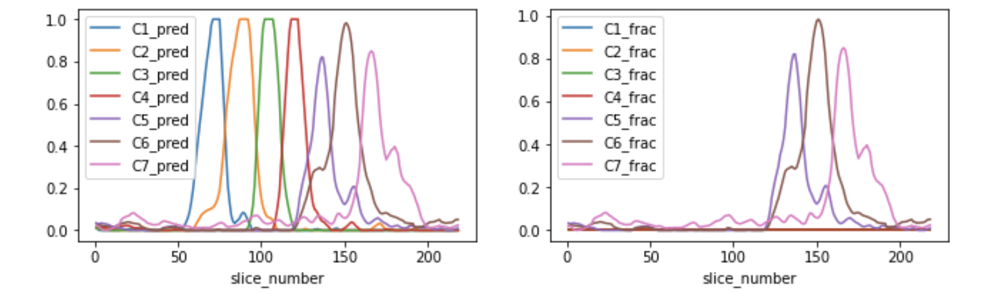

# RSNA22
RSNA 2022 - 3rd Place solution - Cervical Spine Fracture Detection

This is the source code for the 3rd place solution to the [RSNA 2022 Cervical Spine Fracture Detection](https://www.kaggle.com/competitions/rsna-2022-cervical-spine-fracture-detection).  
Video overview: [link](https://youtu.be/x3BLoHkzUYc)  
Slides : [link](https://docs.google.com/presentation/d/1lS4yOTJT4EyaCjODGIO811RGex9jKQdZypzOjY_jxDA/edit?usp=sharing)
  
Sponsored by [RSNA](https://www.rsna.org/)
   
 

## Environment set up

For convenience of monitoring models we are using [neptune.ai](https://neptune.ai/home). 
In the configs, in the `config/` directory, I have set the neptune project to `light/kaggle-rsna2022`. 
You can switch this to your own neptune project, or else create a neptune project with that name.
   
We ran everthing in a nvidia docker environment. 
Make sure you have at least 40GB GPU memory. If you have less, reduce batchsize by a factor of 2 and increase accumulation by a  factor of 2 in each config file.
   
To use docker to set up the environment, you can run as follows, or else directly install the packages in `requirements.txt`. 

```
docker build -t rsna22 -f setup.docker .
docker run -itd --name RSNA22 --shm-size=128G --gpus '"device=0"' --rm rsna22:latest
docker attach RSNA22
```

   
## Data set up

Set up your [kaggle api](https://github.com/Kaggle/kaggle-api) for data download and run the below script. 
```
./bin/1_download.sh
```
The data is already split into folds and provided in the repo at `datamount/train_folded_v01.csv`.

## Training

The training steps are detailed below. To run the full training pipeline, just execute, 
```
./run_all.sh
```

For reference, the scruture of the training pipeline is below. 

| Script (`bin/`) | Params config (`configs/`) | CNN Backbone| Data procesing (`data/`) | Model (`models/`) | Postprocessing (`postprocess/`) |
| ------------- | ------------- | ------------- | ------------- | ------------- |------------- |
| 1_download.sh | | | | | |
| 2_bounding_box_train_infer.sh | cfg_loc_dh_01B cfg_loc_dh_01B_test | efficientnet_b1 | ds_loc_dh_1A | mdl_loc_dh_1A | pp_loc_dh_01A|
| 3_slice_vertebrae_train_infer.sh | cfg_dh_seg_02G cfg_dh_seg_02G_test | resnest50d | ds_dh_seg_2D | mdl_dh_seg_2C | pp_dh_seg_02A |
| 3_slice_vertebrae_train_infer.sh | cfg_dh_seg_04A cfg_dh_seg_04A_test | resnest50d | ds_dh_seg_2E | mdl_dh_seg_2C | pp_dh_seg_02A |
| 3_slice_vertebrae_train_infer.sh | cfg_dh_seg_04F cfg_dh_seg_04F_test | efficientnetv2_rw_m | ds_dh_seg_2H | mdl_dh_seg_2F | pp_dh_seg_02A |
| 4_vertebrae_fracture_train.sh | cfg_dh_fracseq_04F_crop | resnest50d | ds_dh_fracseg_3A_crop | mdl_dh_seg_3R | |
| 4_vertebrae_fracture_train.sh | cfg_dh_fracseq_04G_crop | seresnext50_32x4d | ds_dh_fracseg_3A_crop | mdl_dh_seg_3R | |
| 4_vertebrae_fracture_train.sh | cfg_dh_fracseq_04F_crop_gx1 | resnest50d | ds_dh_fracseg_3I_crop | mdl_dh_seg_3G_gx1 | |
| 4_vertebrae_fracture_train.sh | cfg_dh_fracseq_04G_crop_gx1 | seresnext50_32x4d | ds_dh_fracseg_3I_crop | mdl_dh_seg_3G_gx1 | |

### Model 1 - find study level bounding boxes. 

For this step run `./bin/2_bounding_box_train_infer.sh`. The details of the steps are below. 

#### Bounding Box Label Creation

The first script, `scripts/_make_bbox_part1.py` uses the segmentations to create a bounding box for 
each slice in the study. We must align the z-axis direction of the slices to match slices for studies,
so we first load all dicom z-axis meta data to get the Study direction. We then load the segmentations, and 
use the outer C1-C7 segment map position to create a bounding box for each slice in the labelled studies. 
This outputs a file, `datamount/train_bbox_v01.csv.gz` in the format seen below. 


```
               StudyInstanceUID  slice_number   x0   y0   x1   y1  has_box  height  width  fold
110   1.2.826.0.1.3680043.10633           111  256  256  256  256        0       0      0     3
111   1.2.826.0.1.3680043.10633           112  256  256  256  256        0       0      0     3
112   1.2.826.0.1.3680043.10633           113  185  223  196  232        1      11      9     3
113   1.2.826.0.1.3680043.10633           114  185  223  196  232        1      11      9     3
114   1.2.826.0.1.3680043.10633           115  185  223  196  232        1      11      9     3
115   1.2.826.0.1.3680043.10633           116  182  215  202  235        1      20     20     3
116   1.2.826.0.1.3680043.10633           117  182  215  202  235        1      20     20     3
```

We also create a file `datamount/train_all_slices_v01.csv.gz` which is used for inference of boxes on all slices. 
This contains study name, slice number and fold for all slices. 

#### Train a bounding box model

To train a bounding box model we will use config `cfg_loc_dh_01B`. This model loads random dicom slices
and learns for each, if there is a vertebrae bounding box, and if there is, what is the position of the 
box. Loss on the bounding box positions is only calculated where we have a bounding box, and loss for probability
of a box being present is calculated for all dicom slices. 

We run this model over each of 5 folds, and repeat it for 3 random seeds each. Obvously this model only,
trains on the slices we have segmentations for.  

#### Run bounding box inference of all images. 

Here we take the weights of all trained models and run inference on all slices from found in the file 
`datamount/train_all_slices_v01.csv.gz`. 
You can check out the config file `cfg_loc_dh_01B_test` for details. 

#### Aggregate bounding box predictions. 

Here we take the mean bounding box for each study / slice, taken over the different seeds. 
We use the probabilities to roughly estimate along the z-axis of each study, 
when the slices begin and end and add this to the file also. 
The bounding boxes for each study are aggregated to a single study level box which surrounds all C1-C7 vertebrae. 

The final outputted file on study level is structured like below, 
```
                           x0   y0   x1   y1  slnum_from  slnum_to  slnum_max
StudyInstanceUID                                                             
1.2.826.0.1.3680043.1679   93  111  389  427          47       203        221
1.2.826.0.1.3680043.1685  117  102  401  329           2       206        215
1.2.826.0.1.3680043.1689  144   97  371  386           2       392        482
1.2.826.0.1.3680043.1708   91  113  437  356          11       167        167
1.2.826.0.1.3680043.1750  145  137  388  391          74       242        308
```

### Model 2 - Slice level vertebrae and fracture labels

For this step run `./bin/3_slice_vertebrae_train_infer.sh`. The details of the steps are below. 

 

In this step we train a model to learn the vertebrae volume ratio in each slice. 
The vertebrae volume ratio is the segmentation pixel count of a slice divided by the max slice-wise pixel count in any slice for the study. 
We multiply these by the study level fracture label to get an estimated slice fracture label as seen in the chart above. 

#### C1-C7 vertebrae label creation. 

The script `scripts/_make_seg_labels_part1.py` creates ratio labels for each vertebrae. This is 
calculated by dividing the number of pixels for a vertebrae in the slice, by the 
slice-wise max segemtation pixel count of the vertebrae in any slice. 

#### Train a vertebrae model on ratio labels

To train a bounding box model we will use three configs `cfg_dh_seg_02G`, `cfg_dh_seg_04A` and `cfg_dh_seg_04F`. 
This model loads a random sequence of 96 dicoms and comverts them to 32 * 3-channel images. 
Two models crop the dicoms based on the bounding boxes and two do not. It then uses a 2D-CNN, followed by a
1D-RNN to learn the vertebrae ration labels. 

#### Run vertebrae inference all studies

Now we load the weights of the trained model and run inference using overlapping windows of each study. 

#### Aggregate vertebrae predictions and make fracture label

The script `scripts/_make_seg_labels_part2.py` takes the average of the slice level vertebrate predictions across the models and windows. 
The predictions represent the vertebrae ratio as described before.  
We then multiply these predictions by the study level vertebrae fracture label to get an approximate slice level vertebrae prediction. 

Below is an example of the values outputted to file for each single slice. 
```
StudyInstanceUID    1.2.826.0.1.3680043.10041
slice_number                              149
C1_pred                                 0.000
C2_pred                                 0.000
C3_pred                                 0.000
C4_pred                                 0.007
C5_pred                                 0.131
C6_pred                                 0.943
C7_pred                                 0.062
fold                                        2
C1_frac                                 0.000
C2_frac                                 0.000
C3_frac                                 0.000
C4_frac                                 0.000
C5_frac                                 0.131
C6_frac                                 0.943
C7_frac                                 0.062
```

### Model 3 - Slice level vertebrae and fracture labels

Here we train up a 2D-CNN & 1D-RNN on random overlapping z-axis slices of each study. 
The labels are the slice level vertebrae and fracture predictions of the previous model. 
These weights are trained to recognise vertebrae and fractures and the mdoel weights are loaded for the next step.  

We run 6 of the same models with a `resnest50d` CNN backbone using different seeds, and 4 
of the same models with a `seresnext50_32x4d` CNN backbone. Besides the CNN backbone 
everything is the same between the two models.

For this step, see PART1 of `bin/4_vertebrae_fracture_train.sh`. 

### Model 4 - Study level fracture labels

For this step, see PART2 of `bin/4_vertebrae_fracture_train.sh`. 

The same architecture again (2.5D CNN+1d RNN) was used to train the full study over 
on the final study level labels, found in `train.csv`. The CNN backbone was loaded 
from the checkpoint weights of model 3 and set to no gradients, and a new 1d RNN 
and attention mechanism were initialized and trained on top of this. 
With the final labels, the competition metric as loss was used. 
If there are more than 192 * 3 slices outputted, torch functional interpolation is 
used to reshape them to a max sequence of 192.
For both model 3 and 4, a single bounding box is used to crop all slices in a study, 
and the same augmentation used across the study. 
For model 4 only, the bounding box range (seen in the description of Model 1) was used 
to exclude slices before the vertebrae started and ended. 
And for model 4, the CNN outputted embeddings were extracted in chunks of 32 * 3 2.5d images.

### Inference

We take the weights of the models stored at the following folders and load them so a kaggle dataset, 
```
weights/cfg_loc_dh_01B/fold-1/
weights/cfg_dh_fracseq_04F_crop_gx1/fold-1/
weights/cfg_dh_fracseq_04G_crop_gx1/fold-1/
``` 
We also use github actions to create a dataset of this repo in kaggle, so the same models and data preprocessing can be used.

The final inference book can be found [here](https://www.kaggle.com/code/darraghdog/rsna-2022-3rd-place-solution-inference?scriptVersionId=109623994). 


